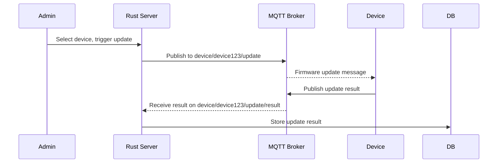

# REQUIREMENT ANALYSIS DOCUMENT

## Module: Rust MQTT Backend Server
**Version:** 0.1  
**Date:** April 2025  
**Prepared by:** Thinh Nguyen

---

## 1. Purpose

This document defines the technical requirements and expected behavior of the Rust backend server that manages MQTT communication with connected C++ client devices. The server is responsible for managing device registration, pushing firmware updates, handling device status reports, and storing update results.

## 2. Scope

This backend module provides:

- A secure MQTT interface
- Device metadata management
- Update notification publishing
- Logging and auditing of firmware update results
- Optional REST API for device management dashboard

## 3. Actors

| Actor | Description |
|:------|:------------|
| Device Client | C++ application running on embedded device |
| MQTT Broker | Middleware handling the message routing |
| Backend Server | Rust-based service handling MQTT subscriptions and publishing updates |
| Admin/DevOps | Person managing firmware rollouts via optional dashboard/API |

## 4. Functional Requirements

### 4.1 Device Registration Handler

- **ID:** SR-001
- **Name:** Track Registered Devices
- **Description:** Server stores metadata of devices during or after registration
- **Fields:** device_id, type, name, status, last_seen, firmware_version
- **Storage:** PostgreSQL or SQLite (deployment choice)

### 4.2 Status Listener

- **ID:** SR-002
- **Name:** Handle Status Messages
- **Topic:** `device/{device_id}/status`
- **Payload:**

```json
{
  "version": "1.2.0",
  "url": "https://example.com/fw/device123.bin",
  "checksum": "abc123def456"
}
```

- **Behavior:** Update database record, store timestamp, log metrics
- **Trigger:** Periodically from client (e.g., every 10 minutes)

### 4.3 Update Publisher

- **ID:** SR-003
- **Name:** Push Firmware Update
- **Topic:** `device/{device_id}/update`
- **Payload:**

```json
{
  "version": "1.2.0",
  "url": "https://example.com/fw/device123.bin",
  "checksum": "abc123def456"
}
```

- **Trigger:** Admin action or automated rollout policy

### 4.4 Update Result Listener

- **ID:** SR-004
- **Name:** Handle Update Results
- **Topic:** `device/{device_id}/update/result`
- **Payload:**

```json
{
  "status": "success",
  "version": "1.2.0",
  "timestamp": 1684325472
}
```

- **Behavior:** Store result in DB, notify admin via dashboard or webhook

## 5. MQTT Topic Summary

| Topic | Direction | Auth | QoS | Description |
|:------|:----------|:-----|:----|:------------|
| device/+/status | Subscribe | Yes | 1 | Receive device status |
| device/+/update/result | Subscribe | Yes | 1 | Receive firmware update result |
| device/+/update | Publish | Yes | 1 | Send firmware update |

## 6. Security Requirements

- Protocol: MQTT over TLS (port 8883)
- Authentication: Username/password or X.509 client certificate
- Authorization: Per-topic access control (ACL)
- Brute-force protection: IP rate limiting
- Logging: All publish/subscription attempts must be logged

## 7. Persistence Layer

| Table | Fields |
|:------|:------|
| devices | id, type, name, firmware_version, last_seen, ip |
| updates | device_id, version, url, checksum, sent_at |
| update_results | device_id, version, status, timestamp |

## 8. Update Distribution Flow



## 9. Error Handling

| Scenario | Server Behavior |
|:---------|:----------------|
| Message parsing failed | Log warning, discard message |
| Device not registered | Log error, optionally reject update |
| MQTT connection lost | Retry reconnect |
| DB insert/update error | Log and retry if critical |

## 10. Non-functional Requirements

- Language: Rust 1.70+
- Frameworks: MQTT (rumqttc or mqtt-async-client), Web (axum, actix-web), DB (sqlx, diesel)
- Performance: Support 1000+ connected devices
- Storage: SQLite (dev) or PostgreSQL (prod)
- Scalability: Horizontal scaling if using external broker (EMQX)

## 11. Optional: Admin API

| Endpoint | Method | Description |
|:---------|:-------|:------------|
| /devices | GET | List registered devices |
| /update | POST | Push firmware to a device |
| /updates/results | GET | View update status per device |

## 12. Firmware Upload API

### 12.1 Functional Overview

Allow administrators to upload new firmware files, validate them, compute checksum, store, and return firmware metadata.

### 12.2 API Endpoint Specification

- Endpoint: POST `/api/firmware/upload`
- Authentication: Required (JWT token or session-based auth)
- Content-Type: multipart/form-data
- Max file size: 50MB (configurable)

Form Fields:

| Field | Type | Description |
|:------|:-----|:------------|
| device_type | String | Target device type |
| version | Semver string | Firmware version |
| firmware_file | Binary | Firmware file |

Successful Response:

```json
{
  "url": "https://server.com/fw/arm_v1.2.0.bin",
  "checksum": "sha256:abcdef123456...",
  "version": "1.2.0",
  "device_type": "arm"
}
```

### 12.3 Database Schema Extension

| Field | Type | Description |
|:------|:-----|:------------|
| id | UUID | Unique firmware identifier |
| device_type | Text | Target device type |
| version | Text | Firmware version |
| url | Text | URL |
| checksum | Text | SHA256 checksum |
| uploaded_by | Text | Uploader info |
| uploaded_at | Timestamp | Upload time |

### 12.4 Validation Rules

- Unique version per device_type
- Server computes checksum
- Allow only .bin, .img
- Max size 50MB
- Authenticated users only

### 12.5 Error Handling

| HTTP Status Code | Meaning |
|:-----------------|:--------|
| 400 | Invalid input or corrupted file |
| 401 | Unauthorized access |
| 409 | Version conflict |
| 500 | Internal server error |

### 12.6 Optional Enhancements

- Auto-trigger MQTT notifications after upload
- Provide GET `/api/firmware/list?device_type=xyz`

### 12.7 Suggested Rust Tech Stack

- Framework: axum or actix-web
- File handling: tokio::fs, uuid
- Hashing: sha2::Sha256
- Storage: Local filesystem or AWS S3
- Authentication: jsonwebtoken (JWT) or axum_sessions

## 13. Firmware Management Dashboard Requirements

### 13.1 Functional Overview

REST APIs and/or web dashboard for admins to manage firmware.

### 13.2 Dashboard Features

| Feature | Description |
|:--------|:------------|
| Firmware List | Table of firmware versions |
| Firmware Upload | Upload new firmware |
| Firmware Details | Metadata view |
| Delete Firmware | Delete firmware if not deployed |
| Trigger Update | Initiate firmware update |

### 13.3 API Design

#### 13.3.1 List Firmware Versions

- Method: GET `/api/firmware/list`

#### 13.3.2 Get Firmware Details

- Method: GET `/api/firmware/{firmware_id}`

#### 13.3.3 Delete Firmware Version

- Method: DELETE `/api/firmware/{firmware_id}`

#### 13.3.4 Trigger Firmware Update

- Method: POST `/api/firmware/trigger`

Payload:

```json
{
  "device_ids": ["device123", "device456"],
  "firmware_id": "uuid-abc123"
}
```

### 13.4 Suggested Dashboard UI

- Firmware List Page
- Firmware Upload Page
- Firmware Detail View
- Firmware Trigger Update Page

### 13.5 Non-Functional Requirements

| Item | Requirement |
|:-----|:------------|
| Authentication | OAuth2, JWT, or Sessions |
| Security | TLS, RBAC |
| Upload Restrictions | Max 50MB, validate file extensions |
| Rate Limiting | Protect upload/delete endpoints |
| Audit Logging | Record admin actions |
| Pagination | Default 50 items/page |

### 13.6 System Architecture Overview

```
[ Admin Frontend ]
    |
 (HTTPS REST API)
    |
[ Backend Server (Rust) ]
    |
 +--------+---------+
 | MQTT Broker (Push updates)
 | Database (Store metadata)
 | File Storage (Store binaries)
```

---

## ⚙️ Rust + Front-end Stack Suggestion

| Layer | Technology |
|:------|:-----------|
| Backend | Rust (axum, actix-web, sqlx, serde) |
| Database | PostgreSQL or SQLite |
| File Storage | Local /var/firmware/ or AWS S3 |
| Front-end | ReactJS, VueJS, or Svelte |
| Front-end Communication | Axios / Fetch |